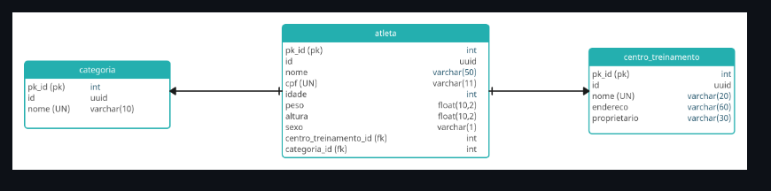

# Desafio Desenvolvendo sua Primeira API com FastAPI, Python e Docker
## Bootcamp LuizaLabs Dio

Com base no Modelo de entidade e relacionamento abaixo:

O Objetivo do desafio
Desenvolver uma API de competição de crossfit chamada WorkoutAPI, aplicando os conhecimentos, de modelagem das tabelas para o SQLAlchemy, schemas e rotas do fastapi.
